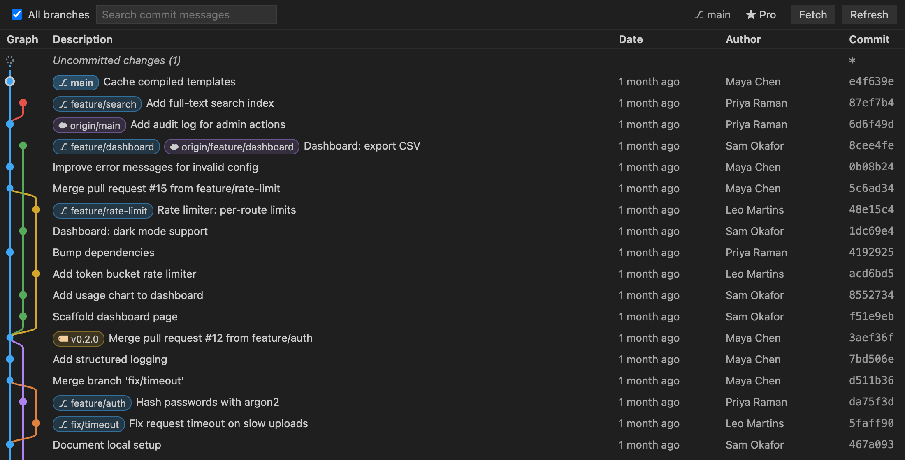
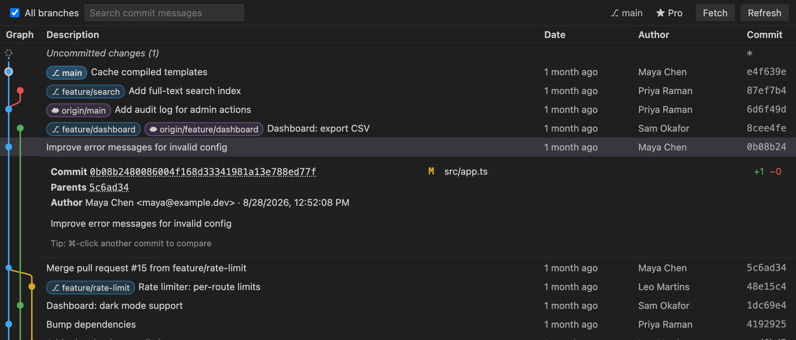
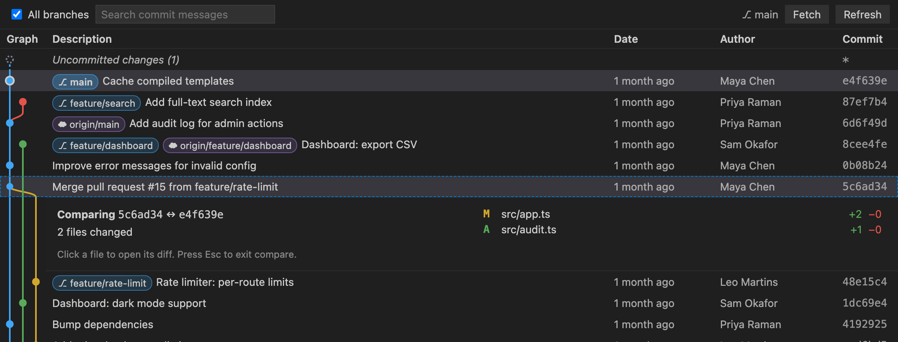
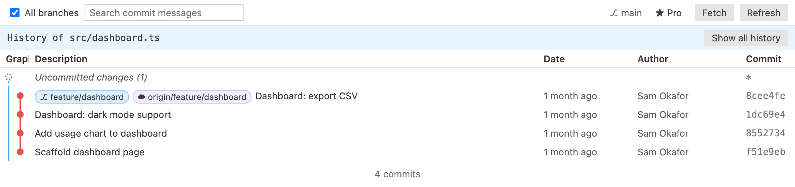

# Branchline — Git Graph for VS Code

**See your whole repository at a glance.** Branchline draws your branches, merges and tags as a clean, colorful graph — and lets you inspect commits, open diffs, and run git actions right from it.

Fast, keyboard-friendly, theme-aware, and **actively maintained**.

## Features

- **Commit graph** — every branch, merge, tag and remote in one view, with stable lanes and colors.
- **Commit details inline** — click a commit to see its message, author, parents and changed files with `+/−` stats. Click a file to open the diff.
- **Uncommitted changes** — your working tree appears at the top of the graph; click it to review what you've changed.
- **Git actions from the graph** — right-click a commit or a branch/tag badge:
  - checkout, create branch, create tag
  - merge (fast-forward, `--no-ff`, or squash), rebase
  - cherry-pick, revert, reset (soft / mixed / hard)
  - rename, push, delete branches (local or remote) and tags
  - every destructive action asks for confirmation first
- **Search** commit messages, toggle **all branches / current branch**, **fetch** from all remotes.
- **Multi-repo workspaces** — switch between repositories from the toolbar.
- **Auto-refresh** whenever the repository changes (commits, checkouts, fetches, edits).
- **Loads on demand** — history is paged in as you scroll, so large repositories open instantly.

## Branchline Pro

Pro is a **one-time purchase** — no subscription — that unlocks power features and funds ongoing development. The same license also unlocks Pro in [TODO Lens](https://marketplace.visualstudio.com/items?itemName=branchline.todo-lens).

- **Compare any two commits** — click a commit, then ⌘/Ctrl-click another to see every file that differs between them, and open side-by-side diffs.
- **File history** — right-click any file (in the Explorer or editor) → *Show File History in Git Graph* to see only the commits that touched it, still drawn as a connected graph.

Get Pro with the **★ Pro** button in the graph toolbar or the `Branchline: Get Branchline Pro` command, then activate it with `Branchline: Enter Pro License Key`. Licenses are verified once and keep working offline.

## Getting started

- Click **Git Graph** in the status bar, or
- click the branch icon in the Source Control view title, or
- run **`Branchline: Show Git Graph`** from the Command Palette.

| Shortcut | Action |
| --- | --- |
| Click | Show/hide commit details |
| ⌘/Ctrl-click | Compare with the selected commit (Pro) |
| Right-click | Commit or branch actions |
| Double-click a branch badge | Check out that branch |
| ⌘/Ctrl-F | Search commit messages |
| Esc | Close details / menu |

## Settings

| Setting | Default | Description |
| --- | --- | --- |
| `branchline.pageSize` | `300` | Commits loaded at a time |
| `branchline.dateFormat` | `relative` | `relative` ("2 days ago") or `absolute` dates |
| `branchline.showStatusBarItem` | `true` | Show the Git Graph button in the status bar |

Branchline uses the git executable configured in `git.path`.

## Also by the author

**[TODO Lens — Better Comments & TODO Tree](https://marketplace.visualstudio.com/items?itemName=branchline.todo-lens)** — color-coded comments and every TODO in your workspace in one tree. Your Branchline Pro license unlocks TODO Lens Pro too.
- **[Snapline — Code Screenshots](https://marketplace.visualstudio.com/items?itemName=branchline.snapline-code-screenshots)** — beautiful code images in your editor's theme, in one click.

## Support

Free and maintained by one developer. If it saves you time, you can [chip in from $1](https://dealership6.gumroad.com/l/support) — or get Pro, which supports development too.

## Feedback

Found a bug or have an idea? [Open an issue](https://github.com/kfirs97/branchline/issues). Reviews on the Marketplace help a lot, too.

## License

Branchline is source-available under the [Branchline License](LICENSE): free to use, read and learn from; redistribution and derivative publications are not permitted.
